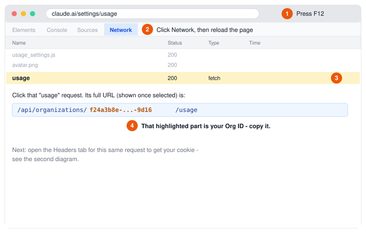
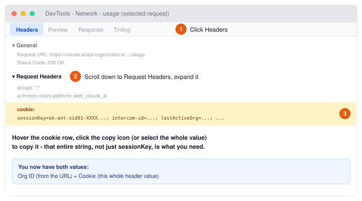

# Getting your Org ID and Cookie

Both [`firmware-direct`'s setup page](../firmware-direct) and
[`cookie-refresh`](../cookie-refresh) need the same two values from
claude.ai. There's no way around grabbing them from DevTools by hand once
in a while (see [cookie-refresh's README](../cookie-refresh/README.md) for
why this can't be automated away) - this page is the visual version of
that dig, so you don't have to remember it.

Takes under a minute once you've done it once.

## 1. Open the Network tab and find the request

Go to `https://claude.ai/settings/usage` in a browser you're logged into,
then follow the numbers:

Your **Org ID** is the part of that URL between `/organizations/` and
`/usage` - a long `xxxxxxxx-xxxx-xxxx-xxxx-xxxxxxxxxxxx`-shaped string.
Copy it.

## 2. Open Headers and copy the cookie

With that same request still selected:

Your **Cookie** is the *entire* value of that `cookie:` row - not just the
`sessionKey=...` part at the start. It's normally a few hundred characters
of `name=value;` pairs strung together. Copy the whole thing.

## 3. Use them

- **First-time setup**: paste both into the form at
  `http://claudeusage.local/`, alongside a passphrase you choose.
- **Refreshing an expired cookie**: run
  [`cookie-refresh/refresh_cookie.py`](../cookie-refresh/refresh_cookie.py)
  (or double-click `refresh_cookie.bat` on Windows) and paste both in when
  it asks - it sends them to the device for you, skipping the web form.

## Notes

- **Firefox/Edge/etc.**: same idea, different chrome around the same
  Network panel - DevTools opens on F12 everywhere, and every major
  browser's Network tab has a Headers view with a `cookie` request header.
- **Don't see a `usage` request?** Make sure you're actually on
  `claude.ai/settings/usage` (not just any claude.ai page) when you
  reload - that's the page that triggers this specific request.
- **This cookie is equivalent to your whole logged-in session** - not just
  "read usage," full account access. Treat it like a password: don't paste
  it anywhere except the device's own setup page/`refresh_cookie.py`, and
  see the root [README](../README.md#security) for how each firmware
  variant stores it.
